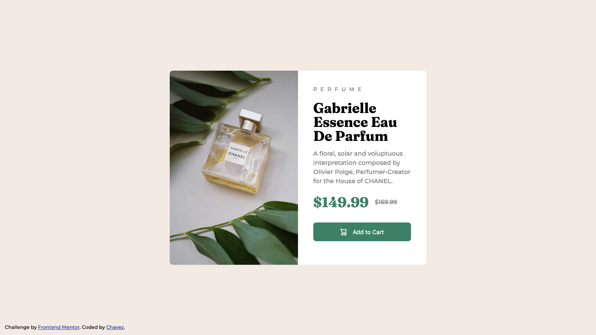

# Frontend Mentor - Product preview card component solution

This is a solution to the [Product preview card component challenge on Frontend Mentor](https://www.frontendmentor.io/challenges/product-preview-card-component-GO7UmttRfa). Frontend Mentor challenges help you improve your coding skills by building realistic projects. 

## Table of contents

- [Overview](#overview)
  - [The challenge](#the-challenge)
  - [Screenshot](#screenshot)
  - [Links](#links)
- [My process](#my-process)
  - [Built with](#built-with)
  - [What I learned](#what-i-learned)
  - [Continued development](#continued-development)
  - [Useful resources](#useful-resources)
- [Author](#author)
- [Acknowledgments](#acknowledgments)

**Note: Delete this note and update the table of contents based on what sections you keep.**

## Overview

### The challenge

Users should be able to:

- View the optimal layout depending on their device's screen size
- See hover and focus states for interactive elements

### Screenshots

#### Mobile


#### Desktop



### Links

- Solution URL: [Add solution URL here](https://your-solution-url.com)
- Live Site URL: [Add live site URL here](https://your-live-site-url.com)

## My process

### Built with

- Semantic HTML5 markup
- CSS custom properties
- Flexbox
- Mobile-first workflow
- HTML5
- CSS3

### What I learned

Use this section to recap over some of your major learnings while working through this project. Writing these out and providing code samples of areas you want to highlight is a great way to reinforce your own knowledge.

To layout the two internal sections of the card side by side, I used the flexible box module (aka flexbox).

To center the product card in the center of the page I made the **body** element of the page a flex parent. With the **card** div being its only child, I applied a `margin: auto` to center the card in the middle of the page. Here's the code:

```html
  <body class="flex">
    <div class="card">
    </div>
  </body>
```
```css
.card {
  background-color: #ffffff;
  width: 42em;
  margin: auto;
  border-radius: 0.5em;
}
```

### Continued development

To get better at transforming designs like these into HTML and CSS code I have to get improve my knowledge on using flexbox and typography spacing.

### Useful resources

- [A Complete Guide to Flexbox](https://css-tricks.com/snippets/css/a-guide-to-flexbox/) - This helped me to get a quick refresher on Flexbox. I really liked this pattern and will use it going forward.

## Author

- Website - [Chavez Harris](https://www.codedbychavez.com)
- Frontend Mentor - [@codedbychavez](https://www.frontendmentor.io/profile/codedbychavez)
- GitHub - [@codedbychavez](https://www.github.com/codedbychavez)

## Acknowledgments

I would like to give a big shout out to the Frontendmentor for creating this challenge.

